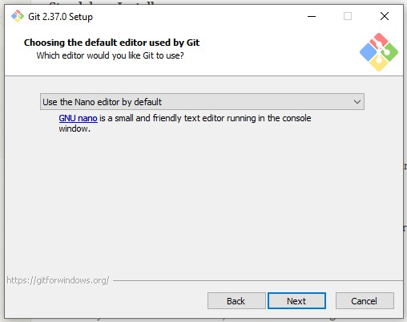
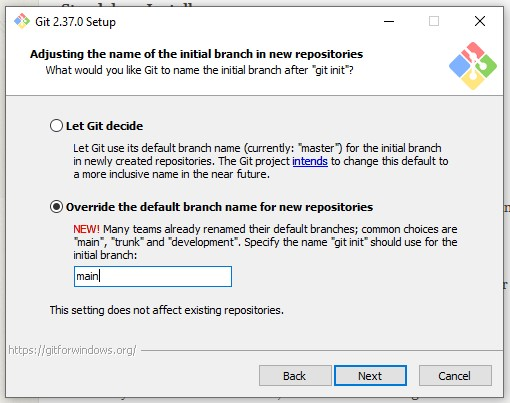
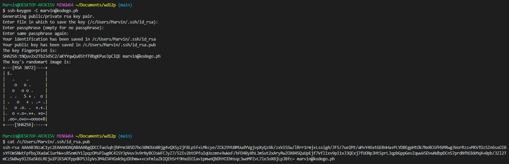
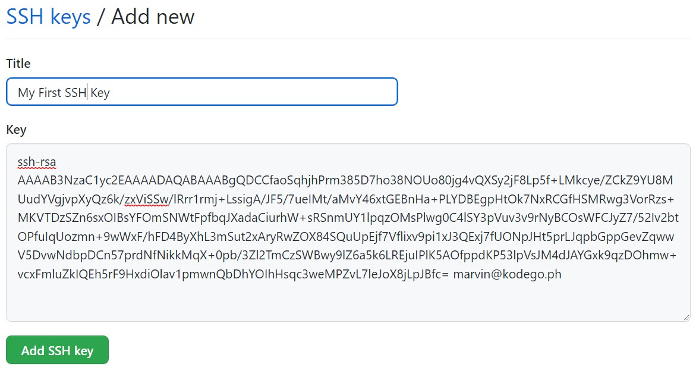
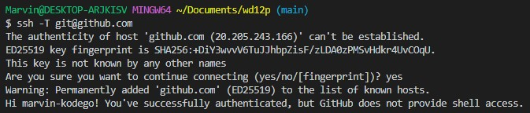
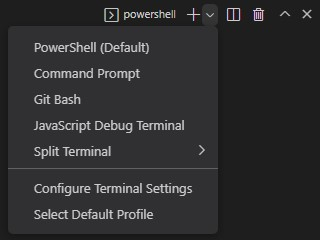
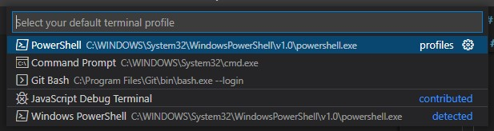

# Git Setup

## Installation
1. Download the installer from [https://git-scm.com/download/win](https://git-scm.com/download/win)
2. Run the installer and accept default values except for:
    - Default editor
        - Use "Nano" instead of "Vim"
        - 
    - Default name of initial branch
        - Choose override and type in "main"
        - 
3. Open a new terminal in VS Code and type `git -v`. The output should look like `git version 2.37.0.windows.1`
    - `View` > `Terminal`
    - `Terminal` > `New Terminal`
4. Configure git by adding your name and email:
```
    git config --global user.email "<GitHub account email>"
    git config --global user.name "<Your name>"
```

## GitHub
1. Create an account at [GitHub](https://github.com)
2. Open VS Code
3. Open a new terminal
4. Create an SSH key by using the command:
```
    ssh-keygen -C <GitHub account email>
```
5. Press `Enter` to accept default SSH location
6. Press `Enter` twice to disable passphrase
7. Take note where the public key was saved
8. View the public key using the command:
```
    cat <location of public key>
```

> The terminal should look something like this:
>
> 

9. Copy the output of the command
10. Add the SSH key to your GitHub account
    1. Go to GitHub's [SSH key section](https://github.com/settings/ssh/new)
    2. Add a descriptive title
    3. Paste the public key
        - 
    4. Click `Add SSH key`
11. Test your key with command:
```
    ssh -T git@github.com
```
12. Type in `yes` to add GitHub to known hosts
13. If you see your GitHub username, congratulations!
    - 

- - -

## Optional Step

### Set `Git Bash` as the default terminal
1. Open the terminal
2. Click the circled dropdown menu
    - 
3. Click `Select Default Profile`
    - 
4. Select `Git Bash` in the displayed options
    - 
5. Close/kill the current terminal by clicking the circled icon
    - 
