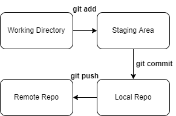

# New Project With Git & GitHub

## GitHub
1. Create new repository and give it an appropriate name
2. Take note of the remote repo's URL. It will look something like:
```
    git@github.com:marvin-kodego/my-first-repo.git
```

## Local Machine
1. Create a new directory and name it `my-first-repo`
2. Create an HTML file with the following content:
```
    <!DOCTYPE html>
    <html>
        <head>
            <title>My First Repo</title>
        </head>
        <body>
            <h1>Hello, world!</h1>
        </body>
    </html>
```
3. Use the command `git init` to transform the current directory into a git repo
4. Use the command `git add .` to add `index.html` to the staging area
5. Use the command `git commit -m "<message>"` to prepare the commit
6. Add the remote repo's URL with the command:
```
    git remote add origin git@github.com:marvin-kodego/my-first-repo.git
```
7. Push local changes to GitHub with the command:
```
    git push -u origin main
```

## GitHub Pages
1. Go to the repo settings
2. Select `Pages`
3. In the `Source` area, click the dropdown and select the `main` branch
4. After a few minutes, your project will be accessible via the URL:
```
    https://<GitHub username>.github.io/<project name>
```

## VS Code
1. Edit the existing HTML file
2. Create and link a CSS file
3. Use the command `git status` to check the status of the local repo
4. Use the command `git diff` to see the changes
5. Push the changes to GitHub
    - Option 1: Push all changes in one commit
        ```
            git add .
            git commit -m "<message>"
            git push
        ```
    - Option 2: Push each change individually
        ```
            git add index.html
            git commit -m "<message>"
            git push

            git add style.css
            git commit -m "<message>"
            git push
        ```
6. Use the command `git log` to see all commits
7. Check the project's GitHub Page to see the change

- - -

## Commands Used
- `git init`
    - Creates new git repo in the current directory
- `git add <file name>`
    - Instead of specifying a file name, the `.` option can be used to add all changes to the staging area
- `git commit`
    - Prepares a commit and uses a Nano editor to edit the commit message
    - The `-m "<message>"` option can be used to set the commit message without opening Nano
    - The `-m "<message>"` option can be used multiple times, adding a new paragraph for every use
- `git remote add <name> <url>`
    - Add a remote repo to the project
- `git push`
    - Pushes local changes to remote repo
    - The `-u <name> <url>` option is used to set a new project or a new branch
- `git status`
    - Displays the status of current project
    - Lists all changed and untracked files
- `git diff`
    - Displays changes to *tracked* files
- `git log`
    - View all commits in the current repo
    - The `-<limit>` option limits the number of commits displayed
    - The `--oneline` option limits the commit details to the first paragraph only

## Notes
- Working directory vs staging area vs local repo vs remote repo
- 
