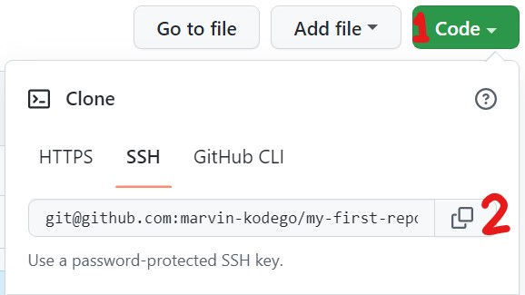

# Existing GitHub Project

1. Copy the repo URL from GitHub
    - 
2. Use the command `git clone <repo URL>`
    - This will create a directory named after the remote repo in the current directory
3. Open the new directory
